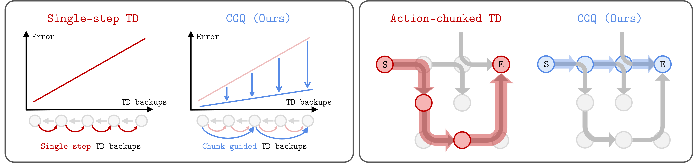

<div align="center">

# Chunk-Guided Q-Learning

</div>

[](https://arxiv.org/abs/2603.13971)
[](https://gwanwoosong.github.io/cgq/)




## Overview
**Chunk-Guided Q-Learning (CGQ)** is an offline reinforcement learning framework that mitigates the error accumulation problem in 1-step TD Learning by regularizing the single-action values toward action-chunk values produced by a chunked critic.


## Installation
```bash
conda create -n cgq python=3.10
pip install -r requirements.txt
```

## Run Experiments
```bash
# CGQ
python main.py --run_group=cgq_reproduce --env_name=puzzle-4x4-play-singletask-task3-v0 --agent=agents/cgq.py --agent.agent_name=cgq --agent.alpha=300 --agent.step_alpha=300 --agent.beta=0.1 --agent.anchor_expectile=0.5 --horizon_length=10

# DQC
python main.py --run_group=dqc_reproduce --env_name=puzzle-4x4-play-singletask-task3-v0 --agent=agents/dqc.py --agent.agent_name=dqc --horizon_length=5 --agent.policy_chunk_size=1 --agent.use_chunk_critic=True --agent.kappa_b=0.7 --agent.kappa_d=0.5

# QC-FQL
python main.py --run_group=qcfql_reproduce --env_name=puzzle-4x4-play-singletask-task3-v0 --agent=agents/acfql.py --agent.agent_name=acfql --agent.alpha=3000 --sparse=False --horizon_length=5

# FQL
python main.py --run_group=fql_reproduce --env_name=puzzle-4x4-play-singletask-task3-v0 --agent=agents/acfql.py --agent.agent_name=acfql --agent.alpha=1000 --sparse=False --horizon_length=1

# NFQL
python main.py --run_group=nfql_reproduce --env_name=puzzle-4x4-play-singletask-task3-v0 --agent=agents/acfql.py --agent.agent_name=acfql --agent.alpha=1000 --sparse=False --horizon_length=5 --agent.action_chunking=False
```

Regarding DEAS, please refer to [DEAS](https://github.com/csmile-1006/DEAS-FQL).


## 100M datasets
Please follow the instructions [here](https://github.com/seohongpark/horizon-reduction?tab=readme-ov-file#using-large-datasets) to obtain the large datasets.


## Acknowledgments
This codebase is built on top of [Reinforcement Learning with Action Chunking](https://github.com/ColinQiyangLi/qc). 

## Citation

If you find this work useful, please consider citing:
```bibtex
@misc{song2026chunkguidedqlearning,
      title={Chunk-Guided Q-Learning}, 
      author={Gwanwoo Song and Kwanyoung Park and Youngwoon Lee},
      year={2026},
      eprint={2603.13971},
      archivePrefix={arXiv},
      primaryClass={cs.LG},
      url={https://arxiv.org/abs/2603.13971}, 
}
```